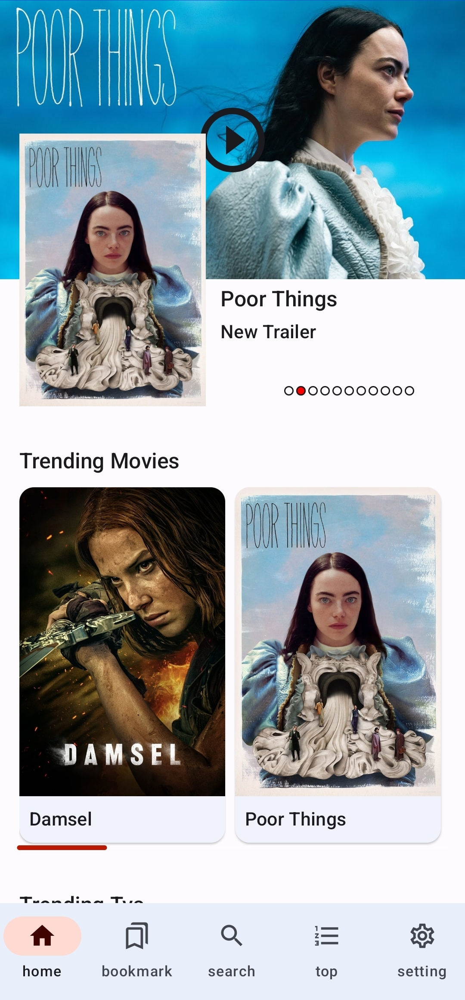
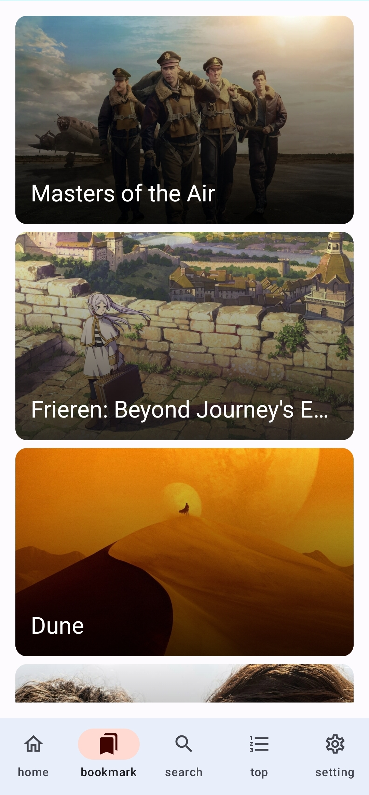
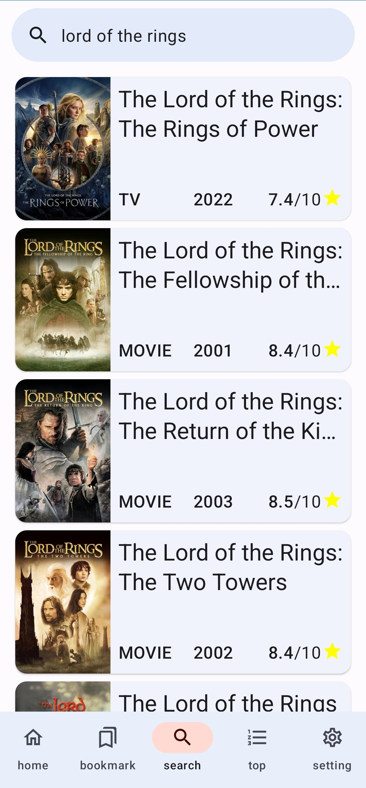
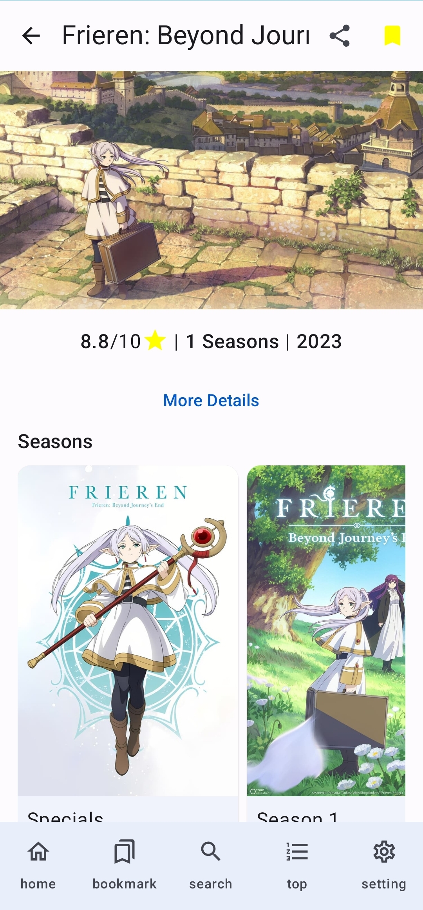

<!-- logo -->

  

<!-- tag line -->
<h1 align='center'> Cine Box</h1>

## Screenshots

  
  
  
  

 

## Features

A movie listing app with Kotlin, Jetpack Compose, and The movie database REST API

. See trending & popular movies, TV shows & animes information

. Bookmark your favorite one to watch later

. Search and find many movies, TV shows & animes

. See top-rated ones 

. Switch between Light & Dark Theme

. Use Android dynamic Theme

 

## Usage

Get an API key from https://www.themoviedb.org/ and place it at

Util -> const -> BEARER_TOKEN

## Technologies & Libraries

. Kotlin Language

. Jetpack Compose for UI

. Room

. Hilt

. Retrofit

. Datastore

. youtubeplayer

. Paging

. Okhttp

. Navigation

. material3

. Coil

## Download

## Special Thanks:

https://www.themoviedb.org for amazing free api
https://logowik.com for logo

## License 

